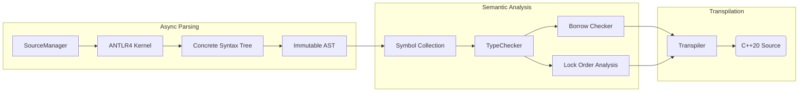

### **Weekly Progress Report: Zinc to C++ Transpiler**

#### **1. Introduction & Core Philosophy**

This project implements a transpiler for Zinc, a statically typed language designed to compile into high-performance, safety-guaranteed C++20.

- **Architecture:** It operates as a transpiler rather than a compiler, leveraging the C++ compiler's backend for optimization while enforcing stricter safety guarantees at the frontend level.
- **Design Philosophy:**
  - **"Pay for what you use":** Direct mapping to C++ primitives where possible (e.g., integers, operators) to ensure zero overhead.
  - **Runtime Augmentation:** A specialized runtime (`runtime.hpp`) provides capabilities absent in C++'s native semantics (e.g., `PolyFunction` for first-class overloaded function sets) with controlled overhead.
  - **Correctness by Construction:** The core hypothesis is that if the Zinc static analysis (Borrow Checker & Lock Order Checker) passes, the generated C++ is guaranteed to be safe. This allows the transpiler to emit performant raw pointers instead of overhead-heavy smart pointers.

#### **2. Architecture Overview**

The system follows a highly parallelized pipeline design, separating immutable syntax from mutable semantics.

#### **3. Key Technical Decisions & Optimizations**

- **Parsing Strategy Migration**
  Migrated the parsing infrastructure from Bison (LALR/Shift-Reduce) to ANTLR4 (Adaptive LL(*)/Top-Down). This architectural shift from a bottom-up state machine to a top-down recursive descent approach aligns naturally with the custom AST builder visitor. It offers superior flexibility in handling context-sensitive syntax and simplifies the generation of meaningful error diagnostics compared to the rigid shift-reduce conflicts often encountered in Bison.

- **Hierarchical Lock-Free Memory Model (PMR Funnel):**

  To maximize allocation performance during compilation, I implemented a custom "Funnel" memory model using C++23 `std::pmr`:

  1. **Thread-Local Unsynchronized Pool:** For resizeable objects (vectors/maps), avoiding atomic overhead.
  2. **Thread-Local Monotonic Buffer:** For fixed-size immutable nodes (AST), offering pointer-bumping speed.
  3. **Upstream Synchronized Pool:** Acts as the backing source, ensuring thread safety only when strictly necessary.

- **Unified AST for Semantic Disambiguation:**

  Zinc supports First-Class Types, leading to syntactic ambiguities. For example, `array[1]` could mean:

  - Type Declaration: An array of type `array` with size 1.
  - Indexing Operation: Accessing the second element of variable `array`.

  I implemented a Unified AST Node design where all expressions inherit from `ASTExpression`. Crucially, the AST structure remains immutable after construction. Semantic distinction is achieved purely through the `eval()` method, which returns a polymorphic `Object*` (resolving to either a `Type*` or `Value*`). This allows the transpiler to handle types as first-class citizens dynamically during semantic analysis without mutating the underlying syntax tree.

- **Optimization via Immutability & Interning:**

  - **Immortal Objects:** `Type*` and `Value*` (compile-time constants) are allocated as immortal objects, simplifying lifecycle management and equality checks (pointer comparison vs. structural comparison).
  - **Flat Data Structures:** Implemented custom `flat_map` and `flat_set` to guarantee data locality and cache friendliness, as standard library implementations are not yet ubiquitous or optimized for this specific workload.

- **Lazy Type Resolution**
  I implemented Lazy Type Resolution by strictly decoupling the Symbol Collection phase from Type Checking. During symbol collection, type definitions are captured as raw AST expressions. These expressions are evaluated into concrete Type objects lazily and on-demand during the Type Checking phase. This strategy, augmented with memorization, efficiently handles forward references and complex dependency graphs (including potential circular types) while maintaining a clean separation of concerns between scoping and typing logic."

- **The PolyFunction Runtime:**

  To support storing "Overloaded Function Sets" as first-class citizens—a feature lacking in C++—I implemented PolyFunction. It utilizes advanced template metaprogramming to perform type erasure while maintaining dispatch capabilities, bridging the semantic gap between Zinc and C++.

#### **4. Development Checkpoints (Milestones)**

The development is structured into granular phases to ensure stability before introducing advanced static analysis features.

| **Phase** | **Checkpoint**           | **Status**  | **Description**                                              |
| --------- | ------------------------ | ----------- | ------------------------------------------------------------ |
| **P1**    | **Core Infrastructure**  | Done        | PMR Memory model, Async File/Module Loading, ANTLR4 Integration. |
| **P2**    | **Basic Semantics**      | Done        | Primitive Types, Symbol Collection, Type Checker, Diagnostic System. |
| **P3**    | **Control Flow & Ops**   | Done        | Control flow (if/for), Operator Overloading via `OperationHandler`. |
| **P4**    | **Transpilation**        | In Progress | Emitting C++20 code based on semantic analysis results.      |
| **P5**    | **Classes & Namespaces** | In Progress | Struct/Class layouts, Member resolution, Namespace scoping.  |
| **P6**    | **Static Safety**        | Planned     | Borrow Checker, Lock Order Checker                           |
| **P7**    | **Metaprogramming**      | Planned     | Template inference and expansion (LSP support if time permits). |
