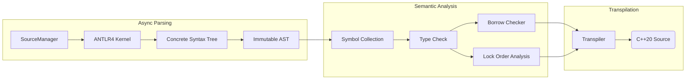

### **Weekly Progress Report: Zinc to C++ Transpiler**

#### 1. Introduction & Core Philosophy

This project implements a transpiler for Zinc, a statically typed language designed to compile into high-performance, safety-guaranteed C++20.

- **Architecture:** It operates as a transpiler rather than a compiler, leveraging the C++ compiler's backend for optimization while enforcing stricter safety guarantees at the frontend level.
- **Design Philosophy:**
  - **"Pay for what you use":** Direct mapping to C++ primitives where possible (e.g., integers, operators) to ensure zero overhead.
  - **Runtime Augmentation:** A specialized runtime (`runtime.hpp`) provides capabilities absent in C++'s native semantics (e.g., `PolyFunction` for first-class overloaded function sets) with controlled overhead.
  - **Correctness by Construction:** The core hypothesis is that if the Zinc static analysis (Borrow Checker & Lock Order Checker) passes, the generated C++ is guaranteed to be safe. This allows the transpiler to emit performant raw pointers instead of overhead-heavy smart pointers.

#### 2. Architecture Overview

The system follows a highly parallelized pipeline design, separating immutable syntax from mutable semantics.



#### 3. ==Language Comparison==

| **Feature**           | **Zinc**                                                     | **C++ (C++20/23)**                                           | **Rust**                                                     | **Zig**                                                  |
| --------------------- | ------------------------------------------------------------ | ------------------------------------------------------------ | ------------------------------------------------------------ | -------------------------------------------------------- |
| **Core Positioning**  | Safe subset & extension for the C++ ecosystem                | High-performance legacy bedrock                              | Safe system language (Rewrite everything)                    | A better C (No hidden control flow)                      |
| **Compilation Model** | Transpiler (to C++) Leverages existing C++ compiler backends | Native Compiler (GCC/Clang/MSVC)                             | Native Compiler (LLVM based)                                 | Native Compiler (LLVM + Self-hosted)                     |
| **Memory Safety**     | RAII + Borrow Check + Lock Order Analysis                    | Relies on discipline (RAII), risk of dangling pointers       | Rigorous ownership & lifetime enforcement                    | No implicit allocation, manual management (Defer)        |
| **C++ Interop**       | Directly inherit classes, instantiate templates, throw exceptions | N/A                                                          | High Friction, requires `cxx`/`bindgen`; struggles with templates/inheritance | Excellent C interop, but limited C++ support             |
| **Metaprogramming**   | C++ Templates + Metaprogramming + Static Reflection          | Powerful but complex syntax and unreadable diagnostics       | Declarative (`macro_rules!`) & Procedural Macros             | Comptime: Arbitrary compile-time code execution          |
| **OOP Support**       | Class + Interface                                            | Multiple inheritance,  diamond inheritance, virtual inheritance | Traits: Composition over inheritance; no class inheritance   | Structs only; polymorphism via composition/tagged unions |
| **Lifetime Syntax**   | Implicit / Anchor-based: No `'a`; uses `&{arg} T` syntax     | Managed mentally by the programmer                           | Complex generic lifetime parameters (`<'a>`)                 | Manual memory management                                 |
| **Error Handling**    | Optional + Expected + Exceptions                             | Exceptions                                                   | Result used with `?` operator                                | Error Unions: Used with `try`; no exceptions             |
| **Syntax & Feel**     | TypeScript-like: Ergonomic, low cognitive load               | Verbose, legacy syntax baggage                               | Unique, steep learning curve                                 | Minimalist C-style: Few keywords, explicit               |

#### 3. Key Technical Decisions

- **Parsing Strategy Migration**

  Migrated the parsing infrastructure from Bison (LALR/Shift-Reduce) to ANTLR4 (Adaptive LL(*)/Top-Down). This architectural shift from a bottom-up state machine to a top-down recursive descent approach aligns naturally with the custom AST builder visitor. It offers superior flexibility in handling context-sensitive syntax and simplifies the generation of meaningful error diagnostics compared to the rigid shift-reduce conflicts often encountered in Bison.

- **Unified AST for Semantic Disambiguation:**

   ==Zinc allows for limited compile-time type manipulation, similar to C++. This capability, however, introduces syntactic ambiguities where type operations and value expressions overlap. For instance, array[1] could be interpreted as:==

  - Type Declaration: An array of type `array` with size 1.
  - Indexing Operation: Accessing the second element of variable `array`.

  I implemented a Unified AST Node design where all expressions inherit from `ASTExpression`. Crucially, the AST structure remains immutable after construction. Semantic distinction is achieved purely through the `eval()` method, which returns a polymorphic `Object*` (resolving to either a `Type*` or `Value*`). This allows the transpiler to handle types as first-class citizens dynamically during semantic analysis without mutating the underlying syntax tree.

- **Lazy Type Resolution**

  I implemented Lazy Type Resolution by strictly decoupling the Symbol Collection phase from Type Checking. During symbol collection, type definitions are captured as raw AST expressions. These expressions are evaluated into concrete Type objects lazily and on-demand during the Type Checking phase. This strategy, augmented with memorization, efficiently handles forward references and complex dependency graphs (including potential circular types) while maintaining a clean separation of concerns between scoping and typing logic.

- **Advanced Type Interning & Recursive Resolution**

  The type system utilizes an advanced interning strategy where every unique type is guaranteed to be a singleton, immutable object, reducing type equality checks to $O(1)$ pointer comparisons. To handle recursive types (e.g., a struct containing a field of its own type) within this immutable framework, I implemented a hypothesis-based structural comparison algorithm. This algorithm assumes equality for currently visiting nodes to detect cycles during traversal. Furthermore, by designing a comprehensive strong ordering for all type structures, the interning registry achieves a lookup and insertion complexity of $O(M \log N)$ (where $M$ is the structural comparison cost), significantly optimizing memory usage and compilation speed compared to naive linear deduplication.

- **Collision-Proof Name Mangling**

  For the transpilation phase, I adopted a strict name mangling scheme using the "\$" symbol to decorate runtime artifacts and hidden static function overloads. Since "\$" is syntactically invalid in user-defined variables within my language but is supported in identifiers by most major C++ compilers (GCC, Clang, MSVC extensions), this creates a guaranteed collision-free namespace. This strategy effectively isolates transpiler-generated constructs from user code without requiring complex renaming algorithms or lookup tables, ensuring that the generated C++ code remains both robust and readable.

- ==**Type Inference for Untyped Literals**==

  Literals in Zinc initially possess unspecified types. For instance, the literal 1 is recognized simply as an integer without an inherent signedness or bit-width. The transpiler resolves these into concrete types based on three rules:

  - Homogeneous Operations: Operations between two unspecified integers (including unary operations) yield another unspecified integer.
  - Type Promotion: When an unspecified integer interacts with a specified type, the result adopts that concrete type.
  - Contextual Enforcement: An unspecified integer is assigned a concrete type upon entering a strongly-typed context, such as an initialization expression in a declaration.

  Floating-point literals do not use a separate intermediate representation; they utilize double as the universal medium for calculations.

  `let a: i8[3] = [1, 20000, 3];`

- ==**Recursive Check-Mode for Declarations**==

  If a declaration explicitly specifies a target type, the assignment proceeds by recursively entering the expression in Check-Mode. This forces the expression tree to adopt the expected type, triggering an error if a node cannot be converted (e.g., due to range overflow or prohibited implicit conversions). For example, in `let a: i8[3] = [1, 2, 3]`, the array node propagates the i8 requirement to its three child nodes, ensuring each element validates itself against the i8 constraints.

#### 4. Development Checkpoints (Milestones)

The development is structured into granular phases to ensure stability before introducing advanced static analysis features.

| **Phase** | **Checkpoint**           | **Status**  | **Description**                                              |
| --------- | ------------------------ | ----------- | ------------------------------------------------------------ |
| **P1**    | **Core Infrastructure**  | Done        | PMR Memory model, Async File/Module Loading, ANTLR4 Integration. |
| **P2**    | **Basic Semantics**      | Done        | Primitive Types, Symbol Collection, Type Checker, Diagnostic System. |
| **P3**    | **Control Flow & Ops**   | Done        | Control flow (if/for), Operator Overloading via `OperationHandler`. |
| **P4**    | **Transpilation**        | In Progress | Emitting C++20 code based on semantic analysis results.      |
| **P5**    | **Classes & Namespaces** | In Progress | Struct/Class layouts, Member resolution, Namespace scoping.  |
| **P6**    | **Static Safety**        | Planned     | Borrow Checker, Lock Order Checker                           |
| **P7**    | **Metaprogramming**      | Planned     | Template inference and expansion (LSP support if time permits). |

#### 5. Concrete Implementation

- **Hierarchical Lock-Free Memory Model (PMR Funnel):**

  To maximize allocation performance during compilation, I implemented a custom "Funnel" memory model using C++23 `std::pmr`:

  1. **Thread-Local Unsynchronized Pool:** For resizeable objects (vectors/maps), avoiding atomic overhead.
  2. **Thread-Local Monotonic Buffer:** For fixed-size immutable nodes (AST), offering pointer-bumping speed.
  3. **Upstream Synchronized Pool:** Acts as the backing source, ensuring thread safety only when strictly necessary.

- **Pointer Tagging for Unified Symbol Storage**

  To optimize the memory footprint of the Scope system, I consolidated the four distinct symbol categories (Type Aliases, Variables, Overloads, and Templates) into a single unified map. Using separate maps for each category would incur a 4x overhead for the map structures and complicate duplicate symbol detection. Instead, I implemented a `PointerVariant` using tagged pointers. By leveraging the 8-byte alignment of the allocated objects, the lower three bits of the pointer are utilized to store the category tag. This allows the compiler to distinguish between symbol types within a standard 64-bit pointer size, simplifying collision checks while maximizing cache efficiency.

- **The PolyFunction Runtime:**

  To support storing "Overloaded Function Sets" as first-class citizens—a feature lacking in C++—I implemented PolyFunction. It utilizes advanced template metaprogramming to perform type erasure while maintaining dispatch capabilities, bridging the semantic gap between Zinc and C++.

- ==**Transition to Arbitrary-Precision Integers (BigInt)**==

  I have overhauled the internal representation of integer values, moving from a tagged union of int64, uint64, and string_view to a unified BigInt implementation. This provides infinite precision for compile-time evaluation; users can now write complex integer expressions as long as the final result fits within the target container. This transition eliminates the overhead of repeatedly tag-checking during integer processing and removes concerns regarding intermediate overflows during constant folding.

#### 6. Next Steps

1. ~~(Done) Template definition and explicit instantiation~~
2. ~~(Done) Refactor operator system~~
3. Built-in types (by declaration file)
4. Mutability
5. Borrow checker (lexical and statement-level lifetimes)
6. Static lock order analysis (lock ranking with escape hatch)

```
fn add(a: &i32, b: &i32, c: &mut i32) {
	*c = *a + *b;
}
```

