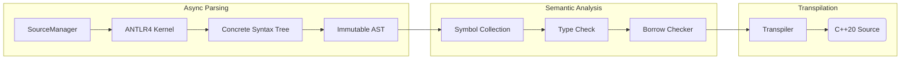

### **Weekly Progress Report: Zinc to C++ Transpiler**

#### 1. Introduction & Core Philosophy

This project implements a transpiler for Zinc, a statically typed language designed to compile into high-performance, safety-guaranteed C++20.

- **Architecture:** It operates as a transpiler rather than a compiler, leveraging the C++ compiler's backend for optimization while enforcing stricter safety guarantees at the frontend level.
- **Design Philosophy:**
  - **"Pay for what you use":** Direct mapping to C++ primitives where possible (e.g., integers, operators) to ensure zero overhead.
  - **Runtime Augmentation:** A specialized runtime (`runtime.hpp`) provides capabilities absent in C++'s native semantics (e.g., `PolyFunction` for first-class overloaded function sets) with controlled overhead.
  - **Correctness by Construction:** The core hypothesis is that if the Zinc static analysis (Borrow Checker & Lock Order Checker) passes, the generated C++ is guaranteed to be safe. This allows the transpiler to emit performant raw pointers instead of overhead-heavy smart pointers.

#### 2. Architecture Overview

The system follows a highly parallelized pipeline design, separating immutable syntax from mutable semantics.

#### 3. Language Comparison

| **Feature**           | **Zinc**                                                     | **C++ (C++20/23)**                                           | **Rust**                                                     | **Zig**                                                  |
| --------------------- | ------------------------------------------------------------ | ------------------------------------------------------------ | ------------------------------------------------------------ | -------------------------------------------------------- |
| **Core Positioning**  | Safe subset & extension for the C++ ecosystem                | High-performance legacy bedrock                              | Safe system language (Rewrite everything)                    | A better C (No hidden control flow)                      |
| **Compilation Model** | Transpiler (to C++) Leverages existing C++ compiler backends | Native Compiler (GCC/Clang/MSVC)                             | Native Compiler (LLVM based)                                 | Native Compiler (LLVM + Self-hosted)                     |
| **Memory Safety**     | RAII + Borrow Check + Lock Order Analysis                    | Relies on discipline (RAII), risk of dangling pointers       | Rigorous ownership & lifetime enforcement                    | No implicit allocation, manual management (Defer)        |
| **C++ Interop**       | Directly inherit classes, instantiate templates, throw exceptions | N/A                                                          | High Friction, requires `cxx`/`bindgen`; struggles with templates/inheritance | Excellent C interop, but limited C++ support             |
| **Metaprogramming**   | C++ Templates + Metaprogramming + Static Reflection          | Powerful but complex syntax and unreadable diagnostics       | Declarative (`macro_rules!`) & Procedural Macros             | Comptime: Arbitrary compile-time code execution          |
| **OOP Support**       | Class + Interface                                            | Multiple inheritance,  diamond inheritance, virtual inheritance | Traits: Composition over inheritance; no class inheritance   | Structs only; polymorphism via composition/tagged unions |
| **Lifetime Syntax**   | Implicit / Anchor-based: No `'a`; uses `&{arg} T` syntax     | Managed mentally by the programmer                           | Complex generic lifetime parameters (`<'a>`)                 | Manual memory management                                 |
| **Error Handling**    | Optional + Expected + Exceptions                             | Exceptions                                                   | Result used with `?` operator                                | Error Unions: Used with `try`; no exceptions             |
| **Syntax & Feel**     | TypeScript-like: Ergonomic, low cognitive load               | Verbose, legacy syntax baggage                               | Unique, steep learning curve                                 | Minimalist C-style: Few keywords, explicit               |

#### 4. Key Technical Decisions

- **Parsing Strategy Migration**

  Migrated the parsing infrastructure from Bison (LALR/Shift-Reduce) to ANTLR4 (Adaptive LL(*)/Top-Down). This architectural shift from a bottom-up state machine to a top-down recursive descent approach aligns naturally with the custom AST builder visitor. It offers superior flexibility in handling context-sensitive syntax and simplifies the generation of meaningful error diagnostics compared to the rigid shift-reduce conflicts often encountered in Bison.

- **Unified AST for Semantic Disambiguation:**

  Zinc allows for limited compile-time type manipulation, similar to C++. This capability, however, introduces syntactic ambiguities where type operations and value expressions overlap. For instance, `array[1]` could be interpreted as:

  - Type Declaration: An array of type `array` with size 1.
  - Indexing Operation: Accessing the second element of variable `array`.

  I implemented a Unified AST Node design where all expressions inherit from `ASTExpression`. Crucially, the AST structure remains immutable after construction. Semantic distinction is achieved purely through the `eval()` method, which returns a polymorphic `Object*` (resolving to either a `Type*` or `Value*`). This allows the transpiler to handle types as first-class citizens dynamically during semantic analysis without mutating the underlying syntax tree.

- **Lazy Type Resolution**

  I implemented Lazy Type Resolution by strictly decoupling the Symbol Collection phase from Type Checking. During symbol collection, type definitions are captured as raw AST expressions. These expressions are evaluated into concrete Type objects lazily and on-demand during the Type Checking phase. This strategy, augmented with memorization, efficiently handles forward references and complex dependency graphs (including potential circular types) while maintaining a clean separation of concerns between scoping and typing logic.

- **Advanced Type Interning & Recursive Resolution**

  The type system utilizes an advanced interning strategy where every unique type is guaranteed to be a singleton, immutable object, reducing type equality checks to $O(1)$ pointer comparisons. To handle recursive types (e.g., a struct containing a field of its own type) within this immutable framework, I implemented a hypothesis-based structural comparison algorithm. This algorithm assumes equality for currently visiting nodes to detect cycles during traversal. Furthermore, by designing a comprehensive strong ordering for all type structures, the interning registry achieves a lookup and insertion complexity of $O(M \log N)$ (where $M$ is the structural comparison cost), significantly optimizing memory usage and compilation speed compared to naive linear deduplication.

- **Collision-Proof Name Mangling**

  For the transpilation phase, I adopted a strict name mangling scheme using the "\$" symbol to decorate runtime artifacts and hidden static function overloads. Since "\$" is syntactically invalid in user-defined variables within my language but is supported in identifiers by most major C++ compilers (GCC, Clang, MSVC extensions), this creates a guaranteed collision-free namespace. This strategy effectively isolates transpiler-generated constructs from user code without requiring complex renaming algorithms or lookup tables, ensuring that the generated C++ code remains both robust and readable.

- **Type Inference for Untyped Literals**

  Literals in Zinc initially possess unspecified types. For instance, the literal 1 is recognized simply as an integer without an inherent signedness or bit-width. The transpiler resolves these into concrete types based on three rules:

  - Homogeneous Operations: Operations between two unspecified integers (including unary operations) yield another unspecified integer.
  - Type Promotion: When an unspecified integer interacts with a specified type, the result adopts that concrete type.
  - Contextual Enforcement: An unspecified integer is assigned a concrete type upon entering a strongly-typed context, such as an initialization expression in a declaration.

  Floating-point literals do not use a separate intermediate representation; they utilize double as the universal medium for calculations.

  `let a: i8[3] = [1, 20000, 3];`

- **Recursive Check-Mode for Declarations**

  If a declaration explicitly specifies a target type, the assignment proceeds by recursively entering the expression in Check-Mode. This forces the expression tree to adopt the expected type, triggering an error if a node cannot be converted (e.g., due to range overflow or prohibited implicit conversions). For example, in `let a: i8[3] = [1, 2, 3]`, the array node propagates the i8 requirement to its three child nodes, ensuring each element validates itself against the i8 constraints.

- **Recursive Type Interning & Canonicalization**

  To support immutable recursive types efficiently, I implemented a comprehensive interning strategy based on structural graph minimization. This system addresses the challenge of cyclic dependencies through a multi-stage resolution process:

  1. **Split-Phase Construction:** Reference types are stored as direct `Type*` pointers rather than double indirections to support both identifiers and raw type expressions. To facilitate this, type construction is strictly separated into **Allocation** and **Initialization** phases. A type address is available in the cache immediately after allocation, allowing recursive references to point to the address of a type that is currently being constructed, regardless of its initialization state.
  2. **Completeness vs. Sizedness:** The system distinguishes between a type being **Sized** (having a known memory layout, e.g., a pointer is 8 bytes) and **Complete** (having all descendants fully initialized). For example, in `type A = { a: &A; }`, the field `&A` is *sized* but *incomplete* until `A` closes the cycle. This distinction is critical for the precise timing for interning: only *complete* subgraphs are eligible for the global pool.
  3. **Dependency-Driven Resolution:** While acyclic (tree-structured) types are interned immediately via standard co-inductive comparison, recursive types utilize a **dependency graph**. An incomplete type registers dependencies on its incomplete children. The type is marked as *complete* only when all dependencies are resolved or when the dependency chain forms a cycle back to itself (closing the loop), at which point it triggers the interning process.
  4. **Two-Phase Interning (Canonicalization):** Interning occurs in two stages to minimize the state machine represented by the type graph:

       - **Self-Interning (Local Canonicalization):** This phase minimizes the newly constructed recursive type graph before it enters the global pool. Using a unified bottom-up coinductive traversal, the algorithm evaluates and locally pools child nodes first. When structurally identical nodes are detected, it discards the duplicate and redirects the parent's edges in-place. This single mechanism naturally resolves both isomorphic cyclic chains (e.g., merging A and B in `type A = { a: &B }; type B = { a: &A };`) and redundant sibling branches (e.g., merging C and D in `type A = { b: &B; }; type B = { c: &C; d: &D; }; type C/D = { a: &A };`). Consequently, all equivalent recursive structures are reduced to a single canonical instance on the fly.
       - **Global Interning:** Once locally minimized, the entire connected component (the type and its dependencies) is promoted to the global registry. This is an **atomic "all-or-nothing" operation**: either the top-level type matches an existing global instance (in which case the entire new graph is discarded to prevent partial dangling references), or the whole graph is interned as a new entry.
  5. **Transient Cache Management:** To prevent the type cache from holding dangling references to discarded temporary types (e.g., intermediate nodes `b1` and `b2` created during the resolution of `type A = { b1: &B; b2: &B; };`), the system implements a **cache invalidation policy**. If a type expression evaluates to an incomplete type, that entry is removed rather than reused. This forces a re-evaluation which, guaranteed by Horizontal Congruence, will eventually merge distinct allocation addresses into a single canonical instance upon completion, ensuring memory safety without complex invalidation sets.

- **Structural-to-Nominal Mapping & Implicit Dependency Reordering**

  Since C++ relies on nominal typing (classes/structs) unlike Zinc's structural type system, the transpiler synthesizes stable nominal definitions (e.g., `struct $structural_1`) for every unique structural shape encountered. A key challenge was handling recursive types: my initial approach relied on fragile forward declarations because the generated struct body referenced external type aliases. The refined strategy decouples the struct definition from its aliases by internally canonicalizing recursive identifiers, enabling a consistent definition-before-use emission order for both recursive and non-recursive types.

  Remarkably, this ordering is achieved without an explicit topological sort algorithm. Instead, it emerges naturally from an on-demand generation model using Cursor proxies. Output tokens are buffered in scoped Cursor instances rather than being written directly to the stream. For a declaration like `type A = B`, the transpiler initializes a cursor for the alias statement "using A = ...". When traversing B, if the structural type `$structural_n` is undefined, a nested cursor is instantiated on the stack to generate its definition. Since the nested cursor completes and flushes its content to the underlying stream before the parent cursor finalizes the alias declaration, the dependency (the struct definition) is guaranteed to appear in the output strictly before its usage, effectively leveraging the transpiler's call stack to enforce topological correctness.

- **C++ Interoperability & The Mutability Inversion Model**

   To ensure seamless interoperability with C++, adopting Rust's reference semantics (which behave primarily as non-nullable pointers) proved structurally inadequate. C++ references are strictly non-rebindable aliases, whereas its pointers accommodate nullability; forcing Rust's model onto C++ generation could mislead developers into writing ill-formed templates, such as std::vector<int32_t&>. Consequently, the language comprehensively inherits C++'s reference and pointer semantics, but fundamentally inverts its mutability paradigm. C++ defaults to pervasive, mutable implicit borrowing, which heavily obfuscates strict static borrow checking. To resolve this without heavily altering C++'s syntactic intuition, the mut keyword is introduced not as a property of the binding (as in Rust), but strictly as a property of the type—acting as the exact inverse of C++'s const. All data access and borrows are strictly immutable by default. While reference borrowing remains implicit and the & operator is traditionally reserved for address-of pointer operations, obtaining mutable access requires explicit opt-in: mut something for references and &mut something for pointers. Ultimately, both pointers and references are uniformly governed by the static borrow checker, ensuring memory safety without compromising C++ compatibility.

- **Explicit `self` and Method References**

   Member functions in Zinc adopt an explicit, strongly-typed `self` parameter, aligning with the paradigms of Python and Rust. To enforce strict syntactic boundaries, invoking a method directly through the class scope, such as `MyClass.func(obj, ...)`, is strictly prohibited. However, the language introduces Java-style method references using the double colon operator (e.g., `MyClass::func`). In Zinc, `::` is exclusively reserved for this purpose, acting as syntactic sugar to generate an anonymous function, rather than serving as a general scope resolution operator.

- **Value Categories and Move Semantics**

   C++ value categories (lvalue, prvalue, xvalue, etc.) and the overloaded semantics of `&&` (rvalue references versus universal references) are notorious sources of confusion. While Rust handles moves implicitly, discarding C++'s granular value semantics is not viable, as they are crucial for paradigms like rvalue-qualified methods in builder patterns. Zinc resolves this friction by elevating `move` and `forward` to first-class language keywords. Obtaining an rvalue is done via `move x`, which evaluates to the type `move &T`. Because moving inherently requires mutability, `move &T` is strictly equivalent to `move &mut T`, allowing intuitive overloads such as `fn func(self: &mut Self)` for lvalues and `fn func(self: move &Self)` for rvalues. Perfect forwarding is similarly streamlined: declaring a universal reference becomes `fn func(x: forward &T)`. This acts as a chameleon—yielding `&T` when passed an lvalue, and `move &T` when passed an rvalue. To pass it downstream, the programmer simply writes `forward x`, entirely eliminating the need to explicitly specify types or grapple with convoluted double-reference (`&&`) syntax, thus drastically flattening the learning curve while preserving C++'s expressive power.

- **Error Recovery & Error Cascading Prevention**

  To enhance diagnostic utility, the type system implements a robust error recovery mechanism. Instead of aborting upon the first semantic failure, the compiler reports the error and injects a sentinel `UnknownType` or `UnknownValue` (depending on the context) as results. These sentinels are designed to silently propagate through upstream operations: any expression interacting with an 'Unknown' operand evaluates to 'Unknown' without emitting further diagnostics. This strategy effectively suppresses cascading false positives (spurious errors) stemming from the initial fault, while preserving the compiler's ability to continue analyzing independent code sections and report multiple genuine errors in a single pass.

#### 5. Development Checkpoints (Milestones)

The development is structured into granular phases to ensure stability before introducing advanced static analysis features.

| **Phase** | **Checkpoint**           | **Status**  | **Description**                                              |
| --------- | ------------------------ | ----------- | ------------------------------------------------------------ |
| **P1**    | **Core Infrastructure**  | Done        | PMR Memory model, Async File/Module Loading, ANTLR4 Integration. |
| **P2**    | **Basic Semantics**      | Done        | Primitive Types, Symbol Collection, Type Checker, Diagnostic System. |
| **P3**    | **Control Flow & Ops**   | Done        | Control flow (if/for), Operator Overloading via `OperationHandler`. |
| **P4**    | **Transpilation**        | In Progress | Emitting C++20 code based on semantic analysis results.      |
| **P5**    | **Classes & Namespaces** | In Progress | Struct/Class layouts, Member resolution, Namespace scoping.  |
| **P6**    | **Static Safety**        | In Progress | Borrow Checker                                               |
| **P7**    | **Metaprogramming**      | Planned     | Template inference and expansion (LSP support if time permits). |

#### 6. Concrete Implementation

- **Hierarchical Lock-Free Memory Model (PMR Funnel):**

  To maximize allocation performance during compilation, I implemented a custom "Funnel" memory model using C++23 `std::pmr`:

  1. **Thread-Local Unsynchronized Pool:** For resizable objects (vectors/maps), avoiding atomic overhead.
  2. **Thread-Local Monotonic Buffer:** For fixed-size immutable nodes (AST), offering pointer-bumping speed.
  3. **Upstream Synchronized Pool:** Acts as the backing source, ensuring thread safety only when strictly necessary.

- **Pointer Tagging for Unified Symbol Storage**

  To optimize the memory footprint of the Scope system, I consolidated the four distinct symbol categories (Type Aliases, Variables, Overloads, and Templates) into a single unified map. Using separate maps for each category would incur a 5x overhead for the map structures and complicate duplicate symbol detection. Instead, I implemented a `PointerVariant` using tagged pointers. By leveraging the 8-byte alignment of the allocated objects, the lower three bits of the pointer are utilized to store the category tag. This allows the compiler to distinguish between symbol types within a standard 64-bit pointer size, simplifying collision checks while maximizing cache efficiency.

- **The PolyFunction Runtime:**

  To support storing "Overloaded Function Sets" as first-class citizens—a feature lacking in C++—I implemented PolyFunction. It utilizes advanced template metaprogramming to perform type erasure while maintaining dispatch capabilities, bridging the semantic gap between Zinc and C++.

- **Transition to Arbitrary-Precision Integers (BigInt)**

  I have overhauled the internal representation of integer values, moving from a tagged union of int64, uint64, and string_view to a unified BigInt implementation. This provides infinite precision for compile-time evaluation; users can now write complex integer expressions as long as the final result fits within the target container. This transition eliminates the overhead of repeatedly tag-checking during integer processing and removes concerns regarding intermediate overflows during constant folding.

#### 7. Remaining Goals

1. Template Syntax
2. Deferred Static Analysis on Template Instantiation
3. Built-in Types (by declaration file)
4. Borrow Checker: Lexical and Statement-level Lifetimes
5. Borrow Checker: Return Type Lifetime Annotations
6. Array Type, Vector Type, Intersection and Union of Dynamic Struct Type
7. Completing Built-in Types
8. Method Reference
9. Metaprogramming: Built-in Predicates
10. Metaprogramming: Concepts (Traits)
11. ==Template: Variadic Parameters==
12. ==Abbreviated Function Templates by `auto` keyword==
13. Module System
14. ==Class Template Argument Deduction (CTAD): by in-class deduction guide==
15. ==String Literals As Types==
